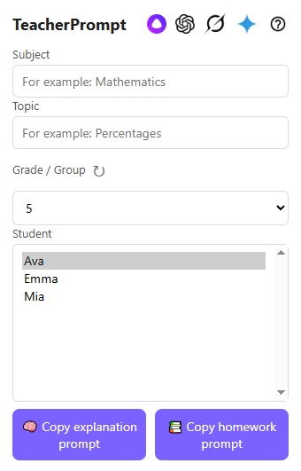

# TeacherPrompt

TeacherPrompt is a browser extension that helps teachers generate personalized AI prompts based on student interests, grade/group, and lesson topic.

The product is designed to make lesson explanations and homework ideas more relevant, engaging, and easier to create in everyday teaching practice.

## Highlights

- Built as a browser extension using Manifest V3
- Uses structured student profile data from Google Sheets
- Integrates with Google Apps Script and Google Sheets for structured data delivery
- Generates ready-to-use prompts for lesson explanations and homework
- Supports privacy-friendly nickname-based student profiles
- Includes quick access to major AI assistants from the extension popup

## Example generated prompts

Example prompt outputs generated with TeacherPrompt: https://chatgpt.com/share/69d2a60b-df68-8391-aca3-5b3b026b49b8

## Tech Stack

JavaScript, HTML, CSS, Chrome Extensions, Google Apps Script, Google Sheets

## Project Scope

TeacherPrompt combines educational domain knowledge with practical software development to solve a real teacher workflow: turning student-specific context into usable AI prompts in just a few clicks.

## Screenshots

Main popup interface of the extension, showing student selection, subject/topic input, and one-click prompt generation for teaching workflows.

## Note

This repository is a public project showcase.  
The full source code is currently private.

## Author

Tokislav
